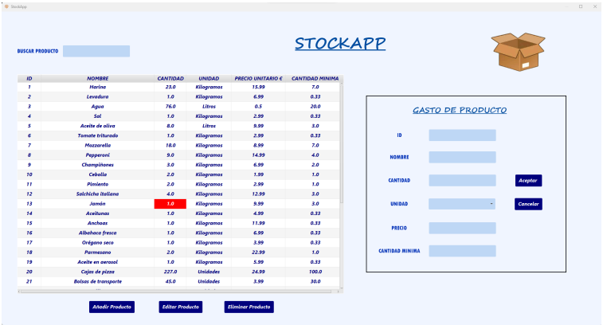
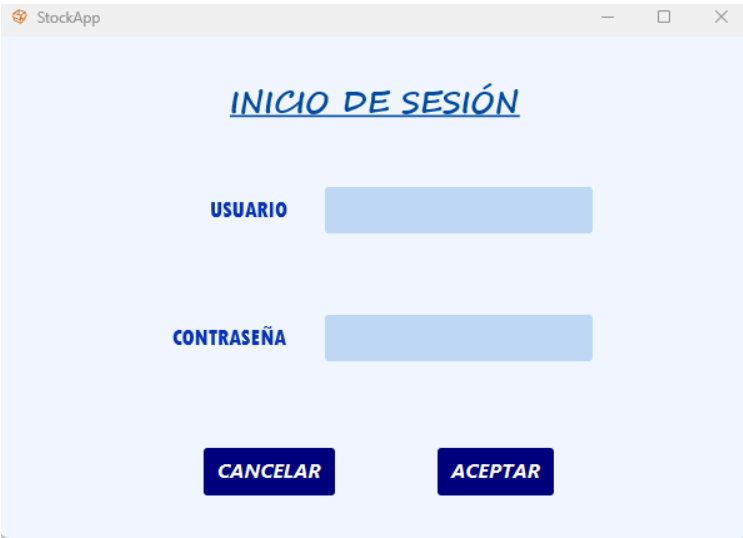
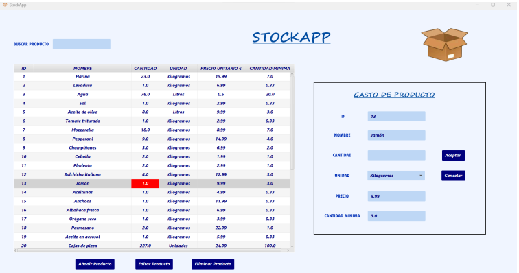

# 📦 StockApp - Sistema de Gestión de Inventarios Inteligente

> **Trabajo de Fin de Grado (TFG)** para el Ciclo Superior de Desarrollo de Aplicaciones Multiplataforma (DAM).
> Calificación: Sobresaliente.


## 📖 Descripción del Proyecto
StockApp es una solución de escritorio robusta diseñada para digitalizar y optimizar el control de almacén en PYMES.

El sistema resuelve la problemática de la gestión manual de inventarios, permitiendo un seguimiento en tiempo real del stock, gestión de proveedores y generación de alertas automáticas para evitar roturas de stock.

---

## 🚀 Características Técnicas Destacadas

### 🛠️ Arquitectura y Diseño
- **Patrón MVC (Modelo-Vista-Controlador):** Separación estricta de la lógica de negocio, la interfaz de usuario y el acceso a datos.
- **Patrón DAO (Data Access Object):** Abstracción completa de la capa de persistencia para un código más limpio y mantenible.
- **Singleton:** Implementado para la gestión eficiente de la conexión a la base de datos.

### ✨ Funcionalidades Clave
- **🔐 Seguridad:** Sistema de autenticación cifrado con roles diferenciados (Administrador / Empleado).
- **📊 Gestión en Tiempo Real:** CRUD completo (Crear, Leer, Actualizar, Borrar) de productos y proveedores.
- **⚠️ Sistema de Alertas:** Notificaciones visuales automáticas cuando un producto está por debajo del stock mínimo.
- **📄 Informes:** Capacidad de exportar listados y estados de inventario.

---

## 📸 Galería de la Aplicación

### 1. Panel de Control Principal
*Interfaz intuitiva desarrollada con JavaFX y Scene Builder, permitiendo filtrado rápido y visualización clara del stock.*


### 2. Gestión de Seguridad (Login)
*Control de acceso robusto contra base de datos MySQL.*


### 3. Formulario de Producto y Validaciones
*Entrada de datos con validaciones en tiempo real para asegurar la integridad de la información.*


---

## 🔧 Instalación y Despliegue

**Requisitos previos:**
- Java JDK 17 o superior.
- MySQL Server (XAMPP/WAMP).

**Pasos:**
1. Clonar el repositorio:
   ```bash
   git clone https://github.com/daviidromo/StockApp.git
2. Importar la base de datos:
   Ejecuta el script db_script.sql en tu gestor MySQL.
3. Configurar conexión:
   Edita DatabaseConnection.java con tus credenciales locales.
4. Ejecutar:
   Lanza la aplicación desde tu IDE favorito (IntelliJ / NetBeans).

👤 Autor
David Romo 
<a href="https://www.linkedin.com/in/david-romo-escobar/">
    
</a><br>
👤 Autor
Sergio Rodríguez
<a href="https://www.linkedin.com/in/sergio-rodr%C3%ADguez-g%C3%B3mez/">
    
</a><br>
⭐ ¡Apoya el proyecto!
Si este sistema de gestión de stock te ha parecido útil o interesante, por favor considera darle una Estrella al repositorio o hacer un Fork para contribuir con tus propias mejoras. ¡Tu apoyo ayuda a que el proyecto siga creciendo!
